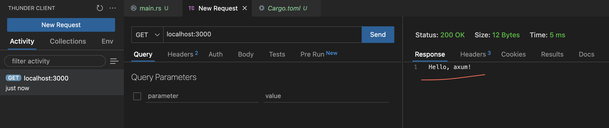
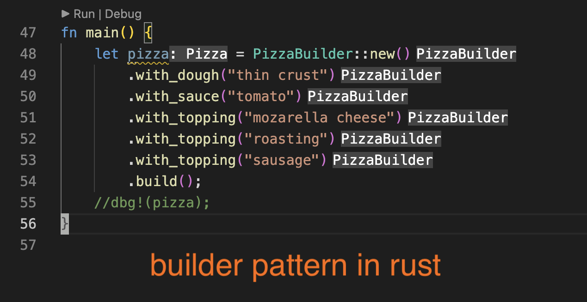
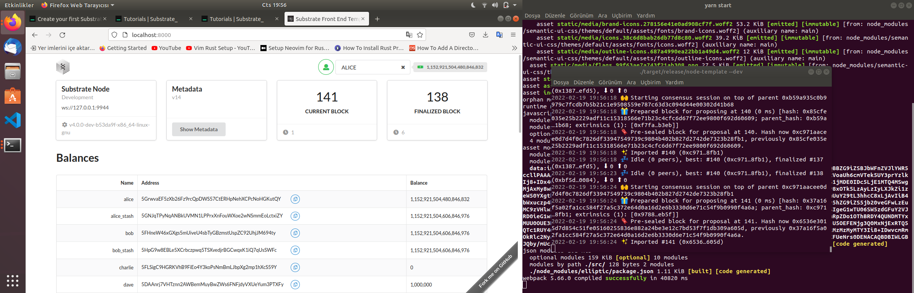

# Rust-Examples

[benchmark](benchmark)
------
Basic benchmark example. You can run with this command.

```
cd benchmark
cargo bench
```

-------

[artificial intelligence](artificial_intelligence/)
------
You can review the experiments on artificial intelligence.

------

[actix examples](actix_examples/)
------
The folder containing the list of my experiments with `actix_web`.

------

[axum examples](axum_examples/)
------
`Axum` is a web application framework that focuses on ergonomics and modularity.



------

[design patterns](design_patterns/)
------
The folder containing the list of design patterns in `rust`🦀.


------

[blockchain](blockchain)
------
Basic blockchain hash code example. You can run with this command.

```
cargo run
```

------

[rocket-db](rocket-db)
------
Examples Rust's rocket and diesel frameworks. Rocket framework has a big difference between  **0.4** and **0.5** versions that's why I used pre-release version. Used with diesel MySQL. You can run below command and test it at your browser `http://localhost:8000` adress.

```
cargo run
```

------

[tokio](tokio)
------
Tokio is an asynchronous runtime for the Rust programming language. It provides the building blocks needed for writing networking applications. It gives the flexibility to target a wide range of systems, from large servers with dozens of cores to small embedded devices.

------


## substrate node template

Substrate is an open source blockchain framework. Substrate enables developers to quickly and easily build future proof blockchains optimized for any use case. 

> **Note:** I did not upload the codes because the file size is quite large and I will have to parse and upload many details. I think it's enough to upload a screenshot of a demo I'm running.
------
