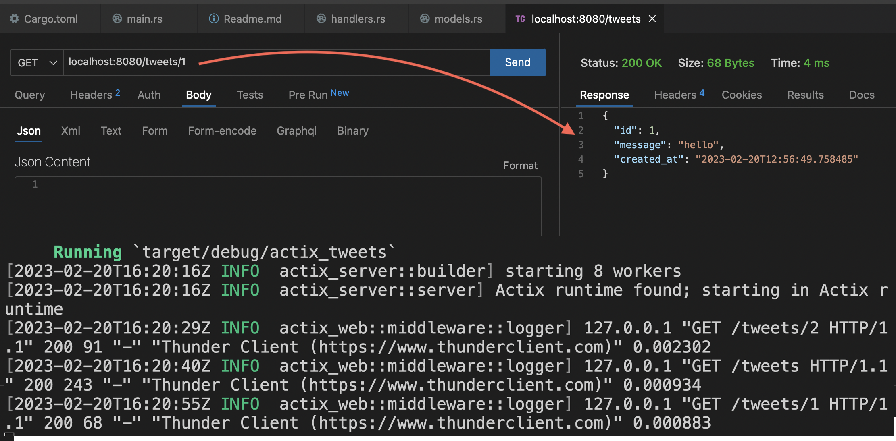

## [actix tweets](actix_tweets/src/main.rs)

`Actix`, diesel frameworks, I created an example that shows CRUD operations and allows you to tweet. Postgresql was used as database.

A basic example of tweets using actix.

- `localhost:8080/tweets` -> GET method to print all data.
- `localhost:8080/tweets/id` -> GET method to print id's tweet.
- `localhost:8080/tweets` -> Printing text to database using POST method with JSON file.
- `localhost:8080/tweets/id` -> Updating text to database using PUT method with JSON file.
- `localhost:8080/tweets/id` -> Deleting the tweet in the database by id number with DELETE.

## [REST employees](REST_employees)

Example of `CRUD` operation with REST API.

- `localhost:8080/employees` -> GET all of data.
- `localhost:8080/employees/id` -> GET method to print id's employee.
- `localhost:8080/employees` -> Printing text to database using POST method with JSON file.
- `localhost:8080/employees/id` -> Updating text to database using PUT method with JSON file.
- `localhost:8080/employees/id` -> Deletes all id's data.

## [static code example](serving_static/src/main.rs)

## [rendering dynamic template](rendering_dynamic_templates/src/main.rs)

