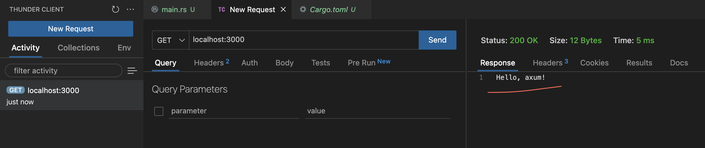

## [hello axum](hello_axum/src/main.rs)

`Axum` is a web application framework that focuses on ergonomics and modularity. Here is the basic axum output.

## [routing](routing/src/)

By examining the `routing` section, you can see the preview components of a basic web page.

- `localhost:3000/mirror_body_string` -> Body String example of axum.
- `localhost:3000/mirror_body_json` -> Json example of axum.
- `localhost:3000/path_variables/91 or number` -> Path variables example of axum.