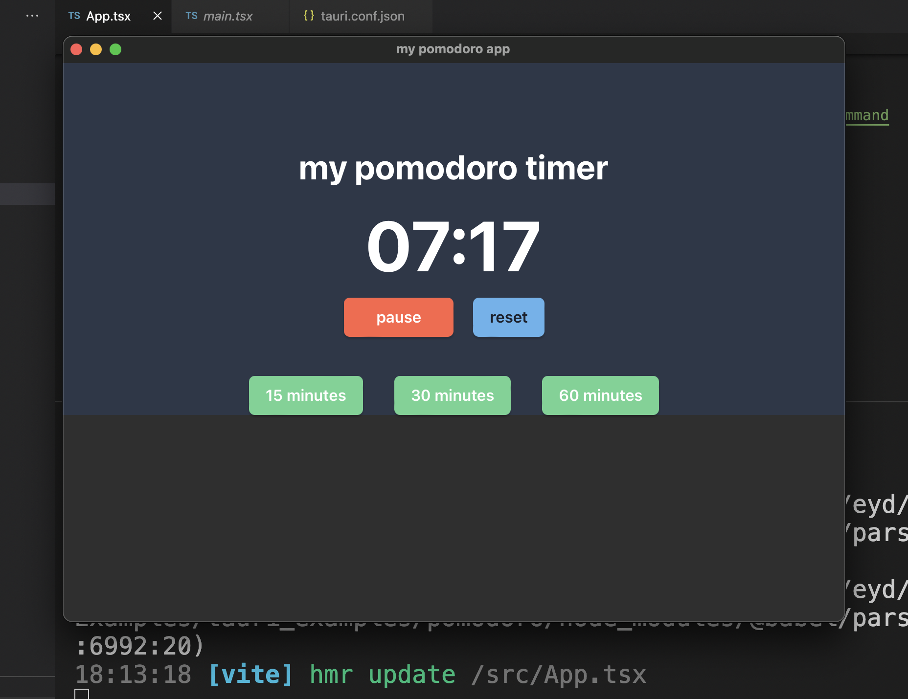

Cross platform applications can be made with the `tauri` framework. You can even produce a mobile application.

## [pomodoro desktop app](pomodoro/)

I created an example that shows pomodoro desktop application.



```
cd pomodoro
npm run tauri dev -> for testing
npm run tauri build -> for build
```